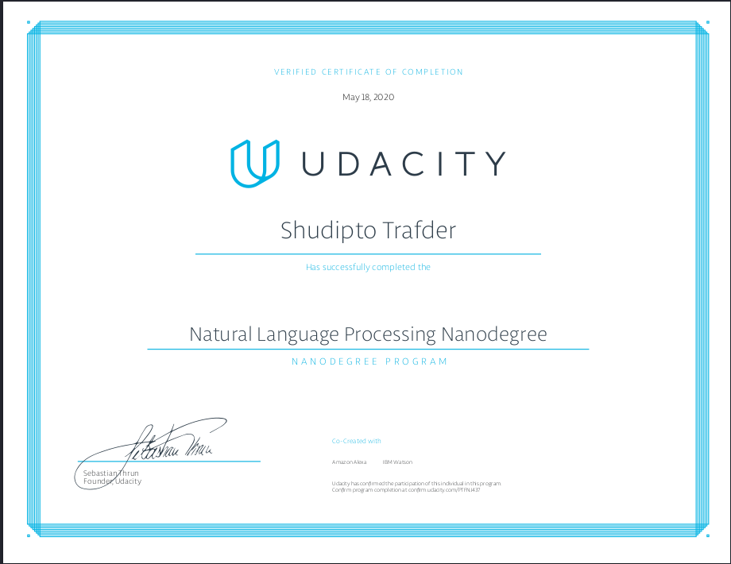

# NLP-ND
This repository contains 3 major projects that were completed as a part of natural language processing nanodegree offered by Udacity. 

## Project 1: Part of Speech Tagging

In this notebook, you'll use the [Pomegranate](https://github.com/jmschrei/pomegranate) library to build a hidden Markov model for part of speech tagging with a [universal tagset](http://www.petrovi.de/data/universal.pdf). Hidden Markov models have been able to achieve >96% tag accuracy with larger tagsets on realistic text corpora. Hidden Markov models have also been used for speech recognition and speech generation, machine translation, gene recognition for bioinformatics, and human gesture recognition for computer vision, and more.

Notebook Link:[HMM Tagger](https://github.com/Iamsdt/NLP-ND/blob/master/HMM%20Tagger./HMM%20Tagger.ipynb)

# Project 2: Machine Translation

Machine translation is a popular topic in research with new papers coming out every year. Over the years of research, different methods were created, like [rule-based](https://en.wikipedia.org/wiki/Rule-based_machine_translation), [statistical](https://en.wikipedia.org/wiki/Statistical_machine_translation), and [example-based](https://en.wikipedia.org/wiki/Example-based_machine_translation) machine translation. With all this effort, it’s still an unsolved problem. However, neural networks have made a large leap forward in machine translation.

In this notebook, you will build a deep neural network that functions as part of an end-to-end machine translation pipeline. Your completed pipeline will accept English text as input and return the French translation.

Notebook Link: [Machine_Translation](https://github.com/Iamsdt/NLP-ND/blob/master/Machine%20Translation/machine_translation.ipynb)

# Project 3: DNN Speech Recognizer
In this notebook, a deep neural network that functions as part of an end-to-end automatic speech recognition (ASR) pipeline!

We begin by investigating the [LibriSpeech dataset](http://www.openslr.org/12/) that will be used to train and evaluate your models. Your algorithm will first convert any raw audio to feature representations that are commonly used for ASR. You will then move on to building neural networks that can map these audio features to transcribed text. After learning about the basic types of layers that are often used for deep learning-based approaches to ASR, you will engage in your own investigations by creating and testing your own state-of-the-art models. Throughout the notebook, we provide recommended research papers for additional reading and links to GitHub repositories with interesting implementations.

Notebook Link: [DNN Speech Recognizer](https://github.com/Iamsdt/NLP-ND/blob/master/DNN%20Speech%20Recognizer/vui_notebook.ipynb)

# Certification
